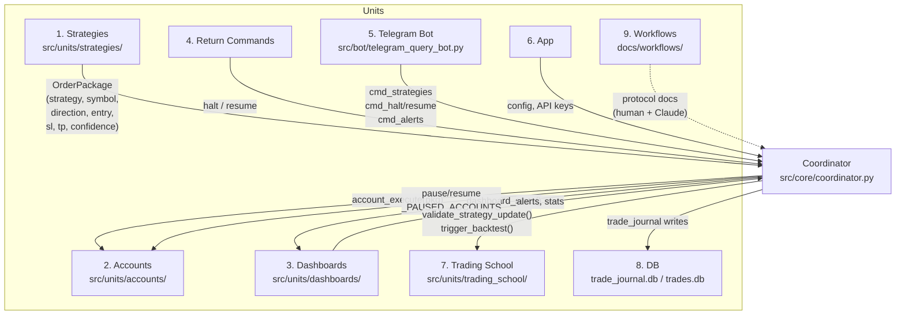

# Architecture Documentation

## Current Structure
```
ict-trading-bot/
  config/       # Configuration files
  data/         # Market data
  deploy/       # Deployment configs
  docs/         # Documentation
  logs/         # App logs
  ml/           # ML models
  runtime_logs/ # Live trading logs
  scripts/      # Utility scripts
  src/          # Source code
  strategies/   # Trading strategies
  tests/        # Tests
```

## Target Structure
```
ict-trading-bot/
  config/
    env/
    settings/
  data/
    historical/
    live/
  docs/
    audit/
    strategies/
    deployment.md
  ml/
    models/
    training/
  src/
    api/
    core/
    strategies/
    utils/
  strategies/
    ict/
    vwap/
  deploy/
    docker/
    scripts/
```

## S-008: 9-Unit Translator Architecture (current)

All cross-unit data flows through the **Coordinator** (TRANSLATOR).
No unit calls another unit directly.



### Data flow: live trade
1. Strategy generates `OrderPackage` → `Coordinator.strategy_order_pkg()`
2. Coordinator calls `Coordinator.account_execute(pkg)` → `execute_pkg()` in accounts unit
3. Accounts unit risk-sizes via `size_order()`, submits to exchange
4. Dashboards unit receives alerts pushed by accounts unit
5. Telegram bot reads `dashboard_stats()` / `list_alerts()` — no direct DB calls

### Adding a new strategy
1. Add one entry to `config/units.yaml → units.strategies`
2. Add `src/units/strategies/<name>.py` with `order_package(cfg, candles_df)` function
3. Update `config/strategies.yaml` (service, model, signal_prefixes)

### Key source files

| File | Role |
|---|---|
| `config/units.yaml` | Declares all 9 units + their config |
| `src/core/coordinator.py` | TRANSLATOR — all cross-unit routing |
| `src/units/strategies/_base.py` | Shared helpers (side_to_direction, derive_sl_tp) |
| `src/units/accounts/risk.py` | Fixed-fractional position sizing |
| `src/units/accounts/execute.py` | Order execution + dry-run mode |
| `src/units/dashboards/alerts.py` | Thread-safe ring-buffer alerts queue |
| `src/units/dashboards/stats.py` | Unified stats builder |
| `src/units/trading_school/validator.py` | Strategy metric validation + backtest trigger |
| `src/bot/telegram_query_bot.py` | Telegram UI — Coordinator consumer only |

## Components (pre-S-008 summary)
- **API Layer**: Bybit, Binance exchange APIs
- **Strategy Engine**: ICT, VWAP mean reversion
- **ML Pipeline**: Signal generation models
- **Telegram Bot**: User interface
- **Backtester**: Historical validation
- **Risk Manager**: Position sizing, stop-loss

## Trade Journal Database

SQLite file: `src/bot/trade_journal.db` (also searched at repo root).
Bootstrapped by `scripts/init_db.py` and `src/data_layer/database.py` — both
paths are idempotent and run every startup.

### `trades` table (current schema)

| Column | Type | Notes |
|---|---|---|
| `id` | INTEGER PK | autoincrement |
| `timestamp` | TEXT | signal/entry time |
| `symbol` | TEXT | e.g. `BTCUSDT` |
| `direction` | TEXT | `LONG` / `SHORT` |
| `entry_price` | REAL | |
| `exit_price` | REAL | |
| `stop_loss` | REAL | |
| `take_profit_1/2/3` | REAL | |
| `position_size` | REAL | |
| `setup_type` | TEXT | `FVG`, `OB`, `COMBO`, … |
| `killzone` | TEXT | `London Open`, `NY Open`, … |
| `bias` | TEXT | `BULLISH`, `BEARISH`, `NEUTRAL` |
| `entry_reason` | TEXT | |
| `exit_reason` | TEXT | |
| `pnl` | REAL | |
| `pnl_percent` | REAL | |
| `status` | TEXT | `OPEN`, `CLOSED`, `CANCELLED` |
| `notes` | TEXT | |
| `is_backtest` | INTEGER | `0` = live, `1` = backtest |
| `strategy_name` | TEXT | e.g. `breakout_confirmation`, `vwap` |
| `account_id` | TEXT NOT NULL DEFAULT `'live'` | multi-account identifier (added Sprint S-002 M1a) |
| `created_at` | TEXT | `datetime('now')` |

**Index:** `idx_trades_account_created` on `(account_id, datetime(created_at) DESC)` for per-account history queries.

**Migration helpers:** `migrate_add_strategy_name` and `migrate_add_account_id` in both bootstrap files handle pre-existing DBs — safe to run repeatedly.

### `backtest_results` table

Stores aggregate backtest run summaries. See `scripts/init_db.py` for the full column list.
